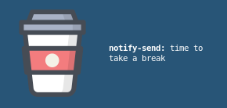

## DailySchedule

- Set your daily schedule
- Flexible setting
 
 

## Requirements

1. Alert Manager (i use dunst)

 
 

## Installation

Instructions will differ for every platform, but install it on `Xubuntu`
 
1. Install 'at' 
[on CentOS based systems]  <b>#</b> yum install at 
[on Debian and derivatives] <b>$</b> sudo apt-get install at
2. cd ~/
3. git clone https://github.com/leonid0723/dailyschedule
4. cd dailyschedule
5. Open <b>daily.sh</b> and change <b>USERNAME</b> to <b>your username</b>
6. chmod +x daily.sh
7. install in autoload dailyschedule. how to install script autoload? google.com
8. <b>./daily.sh</b> 
 Okay! dailyschedule install and work!
 
 

## In future
1. random image 
2. autoinstallation
3. very very very very moreeee images :D

 
 

## Screenshot 

